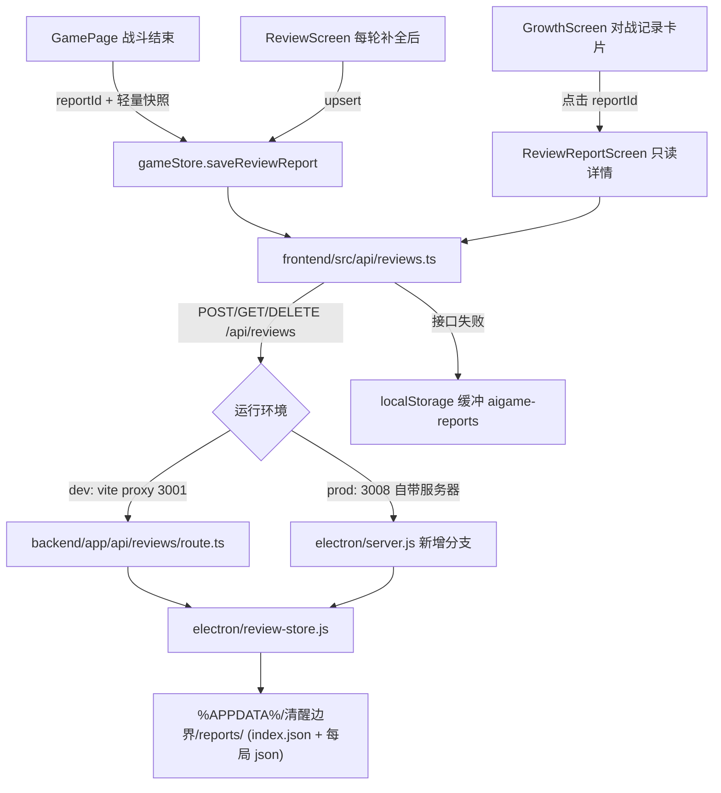

## 产品概述

为《清醒边界》增加"每局复盘报告存档"能力：每个关卡对局结束后，把当局完整复盘内容（逐轮 NPC 话术、玩家回应、四维评分、NPC 动机分析、科普点评、识别要点、替代回应、进步对比）持久化到本地，并在成长页回看、导出。

## 核心功能

- 对局结束时自动保存当局复盘报告（含对话原文与全部点评文本），最多保留 100 局，超出时丢弃最旧的一局
- 逐轮长文本由复盘补全接口陆续生成，生成一轮就更新一次存档，玩家中途退出也不丢已生成内容
- 成长页"对战记录"中每条记录可点击，打开该局只读复盘详情；无存档的旧记录卡片保持不可点击
- 详情页支持导出：JSON（结构化备份）与 Markdown（可读文本，便于分享给心理咨询师）
- 详情页支持删除本局复盘；删除后对应战绩记录保留，仅失去详情入口
- 存档失败（接口不可用）时自动降级为本地暂存，不影响游戏流程

## 视觉与交互

- 沿用现有温暖治愈风（米杏奶油底、圆角卡片、柔和阴影），不引入新视觉语言
- 记录卡片增加"查看复盘"提示与轻微按压反馈；详情页顶部为返回、标题与当局概览，下方按轮次展开，底部为导出/删除操作区
- 详情页为纯只读浏览，不触发任何大模型请求

## 技术选型

- 前端：React + TypeScript + react-native-web（现有工程，Vite 构建），样式复用 `frontend/src/theme.ts` 令牌
- 存储：本地 JSON 文件，写入 `%APPDATA%/清醒边界/reports/`（与 electron-builder `productName` 对应的 userData 目录一致）。**不需要数据库**：无账号体系、单机使用，一局约 10~20KB，100 局约 1~2MB，JSON 文件足以承载且天然可导出
- 传输：沿用现有相对路径 HTTP 约定（`/api/xxx`），不引入 preload/IPC
- 新增依赖：无

## 实现方案

### 关键决策

1. **存储分片，避免单点损坏**：`reports/index.json` 只存轻量元数据数组（id/level/levelTitle/timestamp/victory/avgScore），每局正文独立存 `reports/<id>.json`。写入采用"先写正文、再更新索引"的顺序，索引损坏时可扫描目录重建。
2. **存储层单点实现，双入口复用**：核心读写逻辑放在 `electron/review-store.js`（纯 CJS、零依赖），生产由 `electron/server.js` 直接 require；开发由 Next.js 路由 `backend/app/api/reviews/route.ts` 以相对路径 require 同一模块。这样 dev/prod 行为一致，且打包（`files` 仅含 `electron/**`、`frontend/dist/**`）后仍可用——因此存储层必须位于 `electron/` 目录下，不能放在 `backend/`。
3. **dev/prod 两端点各实现一次**：prod 只有 `electron/server.js` 的 3008 if-else 分发；dev 由 `vite.config.ts` 把 `/api` 代理到 Next.js 3001。两端都必须新增 `/api/reviews` 分支，否则开发态功能不可用。
4. **保存时机覆盖"补全前后"**：

- 战斗结束（进入复盘页前）落一次轻量快照，保证"没看复盘就退出"也有存档；
- 复盘页每轮补全成功后 upsert 更新同一份报告；离开复盘页再做一次兜底 upsert。
- 同一局共用 `reportId`（`${timestamp}-${level}`），upsert 而非追加，避免重复文件。

5. **报告与战绩弱耦合**：`GameRecord` 新增可选 `reportId?: string`，旧存档无该字段 → 卡片自动降级为不可点击（向后兼容，不改旧数据语义）。
6. **失败降级**：前端客户端写盘前先把报告写入 `localStorage` 缓冲键 `aigame-reports`，服务端成功即标记已同步；读取时服务端优先、失败回退本地缓冲，保证进度不丢。

### 性能与可靠性

- 每局写盘次数 = 轮次数（5~10 次）+ 2 次兜底，单次正文 < 20KB，无性能瓶颈；不做额外节流，保持实现简单。
- 索引裁剪为 O(n log n)（按 timestamp 排序取前 100），删除最老的一局为一次 unlink，量级可忽略。
- 读取列表只读 `index.json`，不扫 100 个正文文件，避免详情页列表卡顿。
- 文件写入使用"临时文件 + rename"的同目录替换，防止写盘中途崩溃留下半截 JSON。

## 架构设计



## 目录结构

```
AIGame/
├── shared/src/index.ts                              # [MODIFY] 新增 SavedReviewReport / ReviewReportMeta 类型；GameRecord 增加可选 reportId
├── electron/review-store.js                         # [NEW] 复盘存储层（CJS 零依赖）：解析数据目录、读写 index.json、upsert/查询/删除单局、超 100 局裁剪、索引损坏时扫描目录重建、临时文件 rename 原子写
├── electron/server.js                               # [MODIFY] startFrontend 的 if-else 分发中新增 /api/reviews 分支（GET 列表/详情、POST upsert、DELETE），复用 review-store
├── backend/app/api/reviews/route.ts                 # [NEW] 开发态端点：薄封装调用 ../../../../electron/review-store.js，返回 { ok, ... }，错误统一 500 + JSON 错误体
├── frontend/src/api/reviews.ts                      # [NEW] 前端客户端：listReports / getReport / saveReport / deleteReport，含 localStorage 缓冲与失败降级、返回体校验
├── frontend/src/utils/reportExport.ts               # [NEW] 报告转 Markdown 文本；Blob + a[download] 导出 JSON/Markdown，文件名含关卡与日期
├── frontend/src/store/gameStore.ts                  # [MODIFY] 新增 saveReviewReport（组装当前 review 快照并落盘）、clearReportId（删除报告后清空对应战绩的 reportId）；addGameRecord 支持携带 reportId
├── frontend/src/pages/GamePage.tsx                  # [MODIFY] saveGameRecord 中生成 reportId 一并写入 GameRecord，并触发轻量快照保存
├── frontend/src/components/ReviewScreen.tsx         # [MODIFY] 支持只读模式（数据源可由外部传入、跳过 /api/review/complete 与 markKnowledgeMastered）；每轮补全成功后 upsert 报告；卸载时兜底保存
├── frontend/src/components/ReviewReportScreen.tsx   # [NEW] 历史复盘容器：按 reportId 拉取报告，处理加载/空/失败态，复用 ReviewScreen 只读渲染，底部提供导出与删除
└── frontend/src/components/GrowthScreen.tsx         # [MODIFY] 对战记录卡片改为可点击（仅当 reportId 存在且有存档），点击后内部切换渲染 ReviewReportScreen
```

## 关键代码结构

```ts
// shared/src/index.ts —— 存档报告（新增）
export interface SavedReviewReport {
  id: string;                              // `${timestamp}-${level}`
  version: 1;                              // 结构版本，便于后续迁移
  level: number;
  levelTitle: string;
  timestamp: number;
  victory: boolean;
  avgScore: number;
  dimensions: DimensionScores;             // 本局四维平均（与 GameRecord 一致口径）
  dimensionHistory: DimensionScores[];     // 逐轮四维
  rounds: ReviewRound[];                   // 对话原文 + 全部复盘点评文本
  knowledgePointId?: string;
}
```

接口契约（dev 与 prod 行为一致）：

- `GET /api/reviews` → `{ ok: true, reports: ReviewReportMeta[] }`
- `GET /api/reviews?id=<id>` → `{ ok: true, report: SavedReviewReport }`；不存在返回 404
- `POST /api/reviews`（body 为完整报告，缺 id 时服务端按 timestamp+level 生成）→ `{ ok: true, id: string }`
- `DELETE /api/reviews?id=<id>` → `{ ok: true }`

## 实现要点

- 数据目录解析：`process.env.AIGAME_REPORT_DIR || path.join(process.env.APPDATA || path.join(os.homedir(), "AppData", "Roaming"), "清醒边界", "reports")`，与 Electron userData 对齐，dev/prod 读写同一份；目录不存在时递归创建。
- 所有写操作都要 try/catch 并把错误转成明确 JSON 响应（含错误信息），前端据此降级到 localStorage 缓冲，绝不因为保存失败打断游戏流程。
- 只读模式务必杜绝副作用：不发起 `/api/review/complete`、不调用 `markKnowledgeMastered`、不改 store 中的 review 状态；`ReviewScreen` 现有 `hasFullReviewText` 判定可直接用于"存档中该轮文本是否已补全"的展示。
- 导出走 Blob + `a[download]`，不新增 IPC/preload；文件名形如 `复盘报告_第1关_20260910.md`。
- 改动 `frontend/src/components/BattleScreen.tsx` 时（如需要），必须用 node 直接读盘校验关键字符串与 mtime——该文件历史上出现过"编辑报成功但未落盘"的情况；必要时改用临时 node 脚本做精确字符串替换写回并保持原换行风格，用完删除脚本。
- 清理构建目录（`frontend/dist`、`.next` 等）一律用 PowerShell `Remove-Item -Recurse -Force`，不要用 node 的 rm/rimraf，避免触发 safe-delete shim 导致构建中断。
- 旧存档（无 reportId 的 gameHistory）不做数据迁移，卡片自动降级不可点击即可。
- 日志：沿用现有 `console.warn("[review] ...")` 风格，仅记录 id 与失败原因，不打印报告正文。

## 设计风格

沿用项目既有的"温暖治愈系"设计系统（`frontend/src/theme.ts`），不引入新风格：米杏奶油底 + 暖驼渐变背景、surface 白卡片、22px 大圆角、柔和低透明度阴影。本次新增的界面均以复用现有 ReviewScreen 展示块为目标，只补入口与操作区。

## 视觉与交互设计

- **成长页对战记录卡片（改造）**：保持既有卡片结构与信息层级（关卡 / 胜负 / 标题 / 综合评分 / 时间），在右下角新增"查看复盘 >"弱化文字与 chevron；有 reportId 的卡片可点，按压时阴影从 soft 抬升到 lift 并轻微缩放，无存档卡片保持原样、不显示入口。
- **历史复盘详情页（新增）**：顶部为返回按钮 + "第 N 关复盘"标题 + 当局概览卡（胜负徽标、综合评分大号数字、时间、四维分数条），下方按轮次顺序复用现有复盘块（NPC 的动机、本轮科普点评、识别要点、更好的回应方式、进步对比），已完成补全的轮次直接展示，未补全的轮次显示"该轮点评未生成"灰字占位而不发请求。
- **底部操作区（新增）**：吸底的两个 pill 按钮——主按钮"导出文本"（satge 绿 #A7C0AE）、次按钮"导出 JSON"（淡蓝 #A7C4D4）、危险项"删除本局复盘"（陶土红 #C97B6E 描边样式），删除前弹二次确认。
- **状态设计**：加载中显示骨架卡片与"正在读取复盘…"；报告不存在或读取失败显示空态插画位 + "这份复盘已不存在" + 返回按钮。

## 响应式

沿用桌面窄窗（420px 基准、最小 375px）布局，详情页内容单列纵向滚动，底部操作区 safe-area 内边距对齐现有页面，滚动时保持吸底不遮挡内容。

## Agent Extensions

### SubAgent

- **code-explorer**
- Purpose: 在改造保存链路前，核查全仓库中对 `review.rounds` / `review.dimensionHistory` / `saveGameRecord` / `gameHistory` 的读写调用点，确认没有遗漏的保存触发点或消费方，并确认 `frontend/src/components/BattleScreen.tsx` 是否有需要同步改动的写入路径。
- Expected outcome: 输出一份调用点清单（文件 + 行号 + 用途），据此确定 gameStore 保存 action 与 ReviewScreen/GamePage 的改造边界，避免漏改或误改无关逻辑。