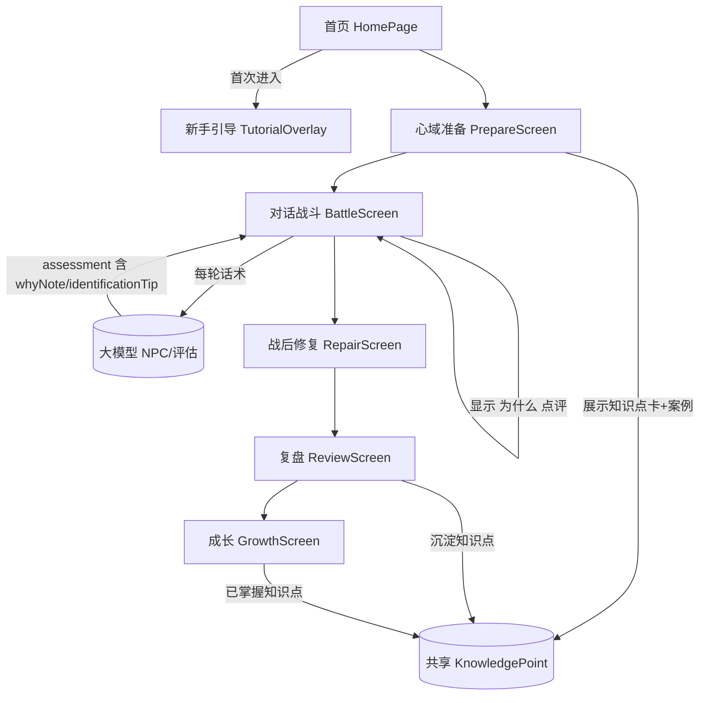

## 产品概述

「清醒边界」是一款由大模型驱动的寓教心理防御游戏，玩家通过对练识别并抵御五类心理操控（煤气灯效应、职场PUA、亲情绑架、匿名网络攻击、隐性歧视）。本次在保持现有三阶段闭环（心域准备→对话攻防→战后修复→复盘→成长）的基础上，进行玩法、界面、提示词与教育内容的全面优化，目标是让游戏更简单上手、更有教育意义、视觉更温暖治愈。

## 核心特性

- 提示词重构：NPC 生成与回合评估提示词纳入教育框架，NPC 话术严格贴合格卡操控手法，评估输出在评分之外增加「识别要点」「为什么点评」「知识点引用」三段式结构化结果。
- 心理学知识点卡：每种操控手法一张，包含定义、识别信号、健康应对话术，在关卡准备页、复盘页、成长页三处沉淀。
- 新手引导教程：首次进入的分步浮层教学（约 4 步），降低上手门槛。
- 每轮「为什么」科普点评：NPC 每次话术后附简短科普，让玩家即时学到一点。
- 关卡真实案例小故事：准备/复盘前后以轻量卡片展示贴近生活的真实案例。
- 玩法学习闭环：知识点卡（课前）→ 为什么点评（课中）→ 复盘沉淀（课后）→ 成长页「已掌握知识点」可视化。
- 温暖治愈系界面：统一柔和低饱和色板、圆角卡片、柔和阴影与友好插画感，覆盖全部页面与弹窗。

## 技术栈

- 前端：React Native (Expo) + react-native-web，Zustand 状态管理，react-native-svg 可视化，react-native-reanimated 动效，样式使用 StyleSheet（非 CSS）。
- 后端：Next.js App Router 路由处理器，OpenAI 兼容流式接口（DeepSeek），SSE 推送。
- 共享：TypeScript 类型包 `@aigame/shared`，前后端共用。
- 维持现有架构不变，不引入新依赖，仅新增主题常量文件与 2 个展示组件。

## 实现方案

1. 提示词重构（backend）：在 `npc/generate/route.ts` 与 `chat/route.ts` 的系统提示词中注入「教育者角色」设定——要求 NPC 仅在指定操控手法与场景内生成话术，并让评估结构化输出新增 `whyNote`（为什么这样操控/科普点评）、`identificationTip`（识别要点）、`knowledgePointId`（关联知识点）。流式解析逻辑（`sse.ts` 已透传完整 assessment）无需大改，前端直接读取新字段。
2. 共享类型扩展（shared）：新增 `KnowledgePoint`、`TutorialStep` 类型；在 `NPCResponseAssessment` 上扩展 `whyNote`、`identificationTip` 字段；关卡案例以 `caseStory` 字段挂在知识点或关卡配置上。
3. 设计系统（frontend/src/theme.ts）：集中定义温暖治愈色板、字号、圆角、阴影、间距常量与少量样式工具函数，全站引用，避免散落硬编码颜色。
4. 状态与数据流：在 `gameStore` 增加当前知识点、已掌握知识点集合、是否看过教程、关卡场景前提等状态；教程标记用 localStorage 持久化（避免重复弹窗）。后端在 NPC 生成时一并产出知识点与案例，经 SSE 落入 store。
5. 学习闭环组件：新增 `KnowledgeCard`（知识点卡）与 `TutorialOverlay`（引导浮层），在准备页、战斗页、复盘页、成长页复用。

## 性能与可靠性

- 提示词增加 token 量有限（知识点仅在生成阶段一次性产出，回合评估仅多 1~2 句），对 30s 超时无实质影响；保持流式与现有 SSE 事件兼容，避免破坏前端解析。
- 教程标记与已掌握知识点用 localStorage 缓存，避免每次重算；BattleScreen 已是重组件，新增「为什么」点评采用可折叠 UI，默认收起，避免额外重渲染与信息过载。
- 类型变更严格前后端同步，新增字段均为可选或带默认值，保证向后兼容。

## 架构设计



## 目录结构

```
shared/src/index.ts                      # [MODIFY] 新增 KnowledgePoint/TutorialStep 类型；NPCResponseAssessment 扩展 whyNote/identificationTip
backend/app/api/npc/generate/route.ts    # [MODIFY] 教育化 NPC 生成提示词，输出含 knowledgePoint/caseStory 的 JSON
backend/app/api/chat/route.ts            # [MODIFY] NPC 人格与评估提示词重构，评估 JSON 增加 whyNote/identificationTip/knowledgePointId
backend/lib/llm.ts                       # [MODIFY] 微调 temperature/超时（可选，保持兼容）
frontend/src/theme.ts                    # [NEW] 温暖治愈设计令牌（色板/字体/圆角/阴影/间距）与样式工具
frontend/src/store/gameStore.ts         # [MODIFY] 增加知识点、已掌握集合、教程标记、场景前提状态，localStorage 持久化
frontend/src/api/sse.ts                  # [MODIFY] 透传评估新字段，保持 SSE 解析健壮
frontend/src/App.tsx                     # [MODIFY] 注入主题背景，挂载一次 TutorialOverlay
frontend/src/pages/HomePage.tsx          # [MODIFY] 温暖治愈首页重构 + 知识点/关卡预告
frontend/src/pages/GamePage.tsx          # [MODIFY] 接入教程与知识点流转，弹窗主题统一
frontend/src/components/KnowledgeCard.tsx   # [NEW] 可复用知识点卡（定义/信号/健康应对/案例）
frontend/src/components/TutorialOverlay.tsx # [NEW] 首次进入分步引导浮层
frontend/src/components/HeartDomainPrepareScreen.tsx # [MODIFY] 展示本关知识点卡与案例，温暖主题
frontend/src/components/BattleScreen.tsx    # [MODIFY] 显示场景前提 + 每轮「为什么」点评 + 知识点提示 + 温暖主题
frontend/src/components/ReviewScreen.tsx    # [MODIFY] 新增知识点沉淀区与每轮科普点评展示，温暖主题
frontend/src/components/RepairScreen.tsx    # [MODIFY] 温暖主题统一
frontend/src/components/GrowthScreen.tsx    # [MODIFY] 新增「已掌握知识点」区，温暖主题
frontend/src/components/HeartDomainMini.tsx # [MODIFY] 配色适配温暖色板（轻量）
```

## 关键代码结构（节选）

```ts
// shared/src/index.ts 新增
export interface KnowledgePoint {
  id: string;            // 如 "kp-gaslight"
  levelId: number;       // 1-5
  tactic: string;        // 操控手法名
  definition: string;    // 一句话定义
  signals: string[];     // 识别信号
  healthyResponse: string[]; // 健康应对话术示例
  caseStory?: string;    // 真实案例小故事
}

// NPCResponseAssessment 扩展字段
export interface NPCResponseAssessment {
  trapType: string;
  trapAnalysis: string;
  playerStatus: "effective" | "shaken" | "trapped";
  dimensions: DimensionScores;
  nextStrategy: string;
  nextDialogue: string;
  alternatives: string[];
  assessment: string;
  conversationEnded: boolean;
  whyNote: string;          // 新增：为什么这样操控的科普点评
  identificationTip: string; // 新增：本轮识别要点
  knowledgePointId?: string; // 新增：关联知识点
}
```

采用温暖治愈系设计语言，构建统一的 React Native（Expo / react-native-web）设计系统。以柔和低饱和的米杏背景、暖陶土与鼠尾草绿为主色，圆角卡片、柔和阴影、友好插画感图标替代原有暗色科技风。所有页面与弹窗复用 `theme.ts` 中的设计令牌，保证视觉一致与护眼舒适。首页加入温暖 Hero 与关卡/知识点预告卡片；准备页以知识点卡作为课程导入；战斗页用可折叠的「为什么」科普条降低认知负担；复盘与成长页以卡片化知识沉淀收束学习闭环。动效保持轻量（淡入、呼吸缩放），强调安抚感而非刺激感。